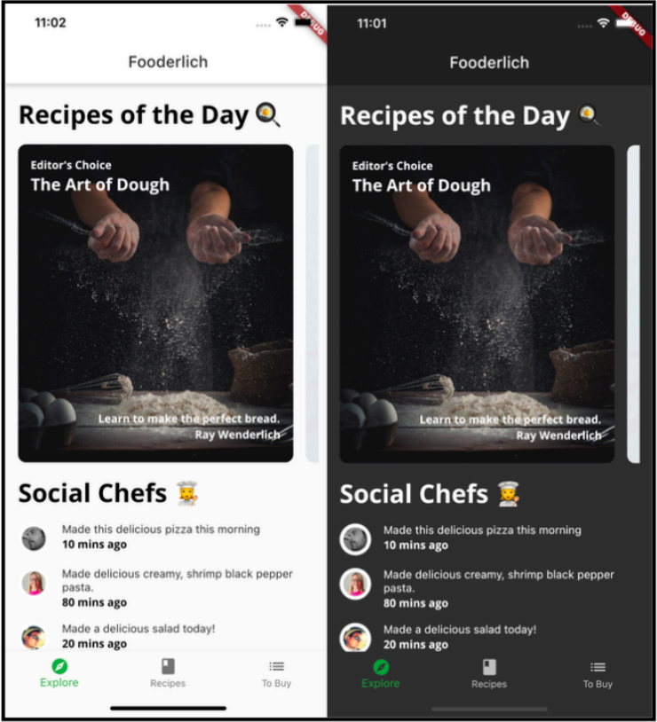
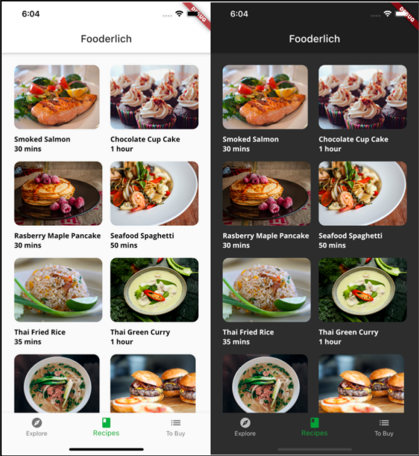

# fooderlich
Its a recipe app, Fooderlich, by adding two new screens: Explore and 
Recipes. 

1- The first shows popular recipes for the day along with what your friends are cooking.

2- The second displays a library of recipes, handy if you’re still on the fence about what to cook today.

## Getting Started

This project is a starting point for a Flutter application.

A few resources to get you started if this is your first Flutter project:

- [Lab: Write your first Flutter app](https://docs.flutter.dev/get-started/codelab)
- [Cookbook: Useful Flutter samples](https://docs.flutter.dev/cookbook)

For help getting started with Flutter development, view the
[online documentation](https://docs.flutter.dev/), which offers tutorials,
samples, guidance on mobile development, and a full API reference.
